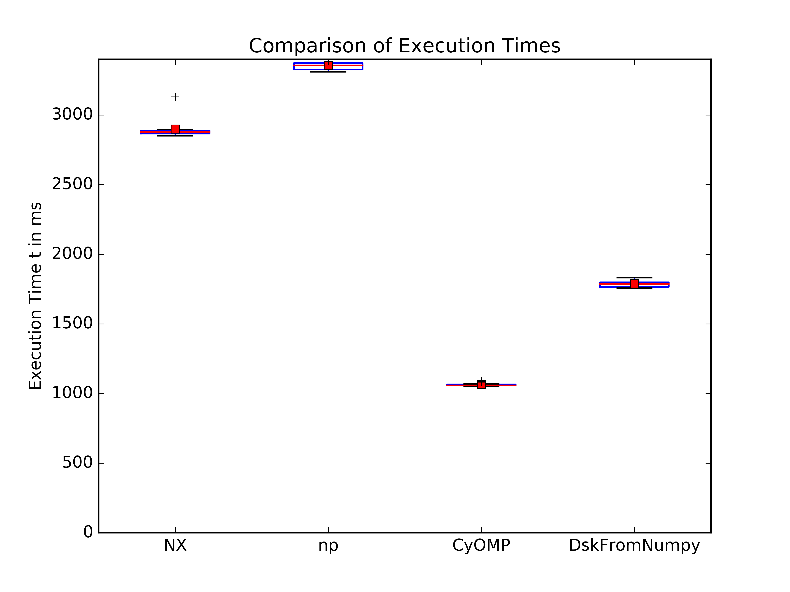

============================================================
Python Data Science Going Functional - Or: Benchmarking Dask
============================================================

:date: 2016-04-17 20:00
:modified: 2016-04-17 20:00
:tags: python, data-science
:category: python
:status: draft

This weekend, I visited PyCon Italy in the pittoreque town
of `Firenze <http://en.wikipedia.com/wiki/Florence>`_. It was
a great conference with great talks and encounters (great
thanks to all the volunteers who made it happen) and amazing
coffee.

I held a talk with the title "Python Data Science Going
Functional" Science Track", where I mostly presented on
Dask, one of those libraries-to-watch in the Python data
science eco system. Slides are available on speaker deck.

.. raw:: html

        

While creating the slides I had stumbled over an exciting tweet
by Travis Oliphant

.. raw:: html

      <blockquote class="twitter-tweet" data-lang="en">
Cool to see dask.array achieving similar performance to Cython + OpenMP: <a href="https://t.co/3tsWCAgWWQ">https://t.co/3tsWCAgWWQ</a>  Much simpler code with <a href="https://twitter.com/hashtag/dask?src=hash">#dask</a>. <a href="https://twitter.com/PyData">@PyData</a>
&mdash; Travis Oliphant (@teoliphant) <a href="https://twitter.com/teoliphant/status/717077047000965120">April 4, 2016</a></blockquote>
        

And after verifying the results on my machine (with some
modifications, as I do not trust ``timeit``), I included a
very similar benchmark in my slides. While reproducing and
adapting the benchmarks, I stumbled over some weirdly long
execution times for the dask `from_array
<http://dask.pydata.org/en/latest/array-api.html#dask.array.core.from_array>`_
classmethod. So I included this finding in my talk's slides
without really being able to attribute this delay to a
specific reason.

After delivering my talk I felt a bit unsatisfied about
this. Why did ``from_array`` perform so badly? So I decided
to ask. The answer: Dask hashes down the whole array in
``from_array`` to generate a key for it, which is the reason
for it to be so slow. The solution is surprisingly simple.
By passing a ``name='identifier'`` to the ``from_array``,
one can provide a custom key and ``from_array`` is a
suddenly a cheap operation. So the current state of my
benchmark shows that Dask improves upon pure numpy or
numexpr performance, however does not quite reach the
performance of a Cython implementation:

   A corrected benchmark showing execution times for numexpr
   (NX), numpy (np) and Cython (with OpenMP parallelization)
   and Cython (including ``from_array``).

The expression evaluated in that benchmark was

.. code-block::

    x = da.from_array(x_np, chunks=arr.shape[0] / CPU_COUNT, name='x')
    mx = x.max()
    x = (x / mx).sum() * mx
    x.compute()

Learnings
---------

What can we conclude from this?

* The conversion overhead of converting a dask array to a
  numpy array is not as bad as I feared.
* There are two aspects in a benchnark: performance and
  usability.
* Dask should be watched not only for out-of-core
  computations, but also for parallelizing simple, blocking
  numpy expressions.
