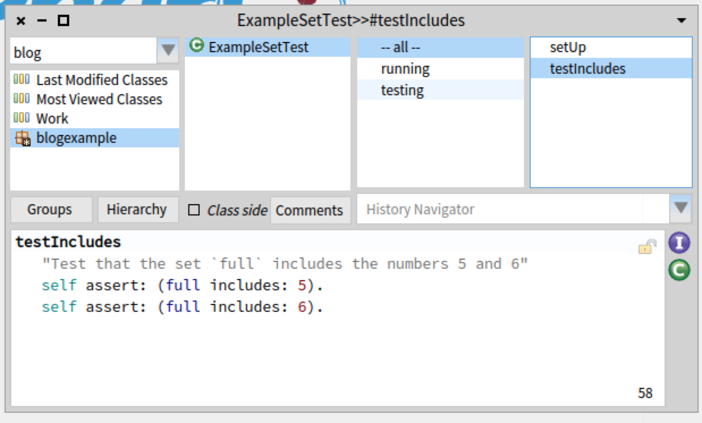

=================
Why I use py.test
=================

:date: 2015-10-10 20:00
:modified: 2015-10-25 13:20
:tags: Testing, Python
:category: python
:summary:  Writing readable and maintainable unit tests is crucial to the success of your Python project. For Python, the unittest module, nosetests and py.test are the most commonly used framework for writing unit tests, and so when you start a project, if no one takes the decision for you, you will have to choose between the three. Over the years, I have become a huge fan of ``py.test``, a mature and well-maintained testing package for Python. That's why I would like to summarize the reasons for me liking ``py.test`` and explain which features make it an indispensable tool for Python development.

Writing readable and maintainable unit tests is crucial to the success
of your Python project. For Python, the unittest module, nosetests and
py.test are the most commonly used framework for writing unit tests,
and so when you start a project, if no one takes the decision for you,
you will have to choose between the three. Over the years, I have
become a huge fan of ``py.test``, a mature and well-maintained testing
package for Python. That's why I would like to summarize the reasons
for me liking ``py.test`` and explain which features make it an
indispensable tool for Python development.

Python's Unittest
=================

To grasp what ``py.test`` does it is worth to take a look at Python's
default module for unit tests which comes with the standard library:
``unittest``.  Unittest is an *xUnit*, which means it is a descendent
of the original `SUnit <http://en.wikipedia.org/wiki/SUnit>`_, a unit
testing frame work for Smalltalk.  Smalltalk, like Java, is a language
where methods are the only kind of functions available. So for writing
a test, one needed to write a test class, and add each test as a
method of that class. These test methods in Smalltalk kind of looked
like this:

.. code-block:: smalltalk

   ExampleSetTest>>setUp
    full := Set with: 5 with: 6

   ExampleSetTest>>testIncludes
    self assert: (full includes: 5).
    self assert: (full includes: 6)

Or rather, as in Smalltalk, all development takes place in a method browser, a
screenshot give you a better impression of the SUnit experience:

   In Smalltalk, editing takes place in a central IDE with a class and method
   browser.

Python unittest looks kind of similar to this, with the difference that class
and method definition appear in the same file (it is the port of a port after
all):

.. code-block:: python

   class TestExampleSet(unittest.TestCase):
       def setUp(self):
           self.full = {5, 6}

       def test_values_in_full(self):
           self.assertIn(5, self.full)
           self.assertIn(6, self.full)

The ``setUp`` method is what we called the test fixture, it is a
method that is called right before executing all the ``test_*``
methods. In our case, this is initializing a set. This method is used
for common initializations that are needed in every test. Now we just
need to run the tests with::

   python -m unittest

It seems a bit weird to use classes for grouping test cases, this is
more like what I would solve with namespaces in Python. Again, the
reason why ``unittest`` organizes tests in classes is: because
Smalltalk did.

Nevertheless, the ``unittest`` module is a proven tool, that
generations of programmers have written unit tests with.  Let's take a
moment to acknowledge that it is a method that is well-respected and
it is totally fine to write tests that way.

It just is not the only way.

pytest
======

Pytest is a test-runner, an extra module to run unittests as easy as::

   py.test

As such, it will run your ``unittest`` style unit tests like the one
we wrote before (which means that you can pretty easily switch to
pytest as a runner for an existing project, without having to rewrite
your old unit tests). But: it will also run simple functions that
start with ``test_*``:

.. code-block:: python

   def test_values_in_full():
       assert 5 in {5, 6}
       assert 6 in {5, 6}

If we want to continue using test fixtures, we can use the
``pytest.fixture`` decorator:

.. code-block:: python

   import pytest

   @pytest.fixture
   def full():
       return {5, 6}

   def test_values_in_full(full):
       assert 5 in full
       assert 6 in full

Comparing this to the unittest tests this differs mainly in two
aspects, the use of fixtures and of assertions.

Instead of manipulating ``self`` of a test object, we just write a
simple test function and use a fixture that we have declared with a
decorator.  pytest's fixture system is **composable** (unlike the more
rigid ``setUp`` method). We can combine several, different fixtures.
Suppose you have one fixture to secure a database connection, and one
fixture to obtain a temporary directory. In ``pytest`` you can use
them as needed in every test individually.

We use plain Python assert statements instead of ``self.assert*``
methods.  Pytest will inspect them to come up with a readable error
message.  I cannot emphasize this enough. Instead of
``self.assertListEqual(a, b)``, we can just type ``assert a == b``,
and ``assert foo()`` replaces ``self.assertTrue(foo())``.

Pytest has accumulated lot's of helpful features for getting the best
from testing. Some of which are:

Reporting Test Durations
------------------------

Using ``--durations=10`` gives you a list of the 10 slowest tests.
This is great if you are aiming for a quick test execution.  Identify
the slowest tests of your test suite and either make them run faster
or mark them as slow tests that you will only run on your CI server or
on demand while you continue to benefit from fast-feedback from your
fast running tests on your development machine.

Turning Warnings into Exceptions
--------------------------------

Using ``--strict`` as an argument to py.test will turn Python warnings
into errors. This is great if you want to trace back the source of
warnings (with a stacktrace), for example to get rid of all
deprecation warnings from your favourite library.

Running Previously Failed Tests Only
------------------------------------

Running last failures first (or only previously failed tests) ``--ff``
(run all tests but the last failure first) and ``--lf`` (rerun only
the tests that failed at the last run) are great when you are working
on getting a test to run.

Show Local Variables
--------------------

Running ``py.test`` with the ``-l`` flag will print out a list of
local variables with their corresponding values when a test fails:

.. code-block:: python

   def test_foo():
       x = 1
       b = "a"
       assert x == len(b)
       assert 2 == len(b)  # <- fail

This test will yield an informative traceback::

        % py.test -l test_f.py
        ================== test session starts ===================
        platform darwin -- Python 3.4.3, pytest-2.8.2, py-1.4.30, pluggy-0.3.1
        collected 1 items

        test_f.py F

        ======================== FAILURES ========================
        ________________________ test_foo ________________________

            def test_foo():
                x = 1
                b = "a"
                assert x == len(b)
        h       assert 2 == len(b)
        E       assert 2 == 1
        E        +  where 1 = len('a')

        b          = 'a'
        x          = 1

        test_f.py:7: AssertionError
        ================ 1 failed in 0.01 seconds ================

so

Plugins
=======

What is also great about pytest are the plugins available for it.

pytest-xdist
------------

`pytest xdist <https://pypi.python.org/pypi/pytest-xdist>`_ is a
plugin that distributes tests over several processes, which will
reduce the runtime of your unit tests. Just::

   pip install pytest-xdist
   py.test -n 4 # for 4 cores

Most recommendations and guides on testing emphasize how important it
is to have unittests run fast. With pytest-xdist we have a simple way
to cut runtimes significantly.

pytest-cov
----------

With pyest-cov installed, you will get coverage information very
easily::

  pip install pytest-cov
  py.test --cov-report html --cov myproject

this will generate a html report in a subdirectory.::

  py.test --cov-report term --cov myproject

will write out coverage information to the terminal. This is nothing
extraordinary, just very convenient.

Conclusion
----------

py.test is a convenient and reliable test runner and testing
framework. Using py.test, test code looks like idiomatic and modern
python code. It has a rich plugin infrastructure with tools for
paralellized test execution, coverage measurement (and for example
tools for pep8/pyflakes checks, etc.).

It is developed outside of the CPython project, which means that you
can benefit from improvements in ``py.test`` directly, regardless
whether you are running legacy python (2.x) or Python 3.

Py.test is `actively developed on github
<http://github.com/pytest-dev/pytest>`_ and is in my experience a
contributor friendly project.

.. note::

   A history of changes and updates of this blog post can be found at
   https://github.com/HolgerPeters/blog/commits/master/pytest.rst
